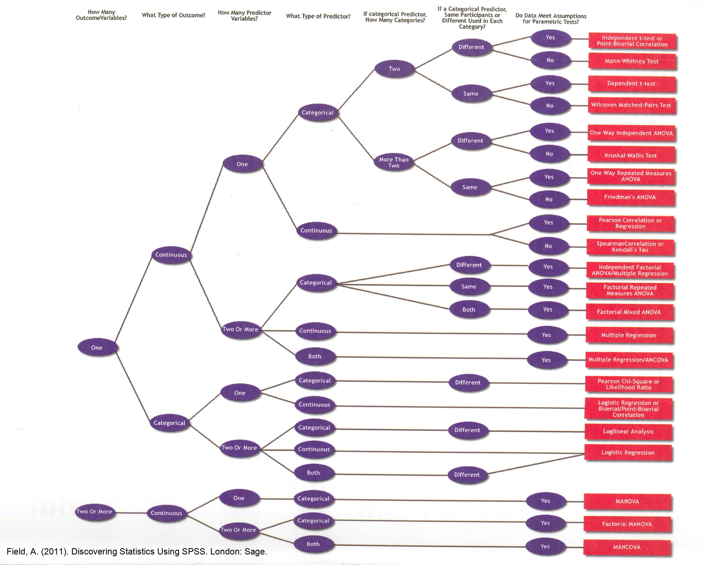

# Agenda

* Introductions
* Syllabus
* Little bit of `R`

---

# About Me

.pull-left[
* Jonathan A. Pedroza (JP)
* First-generation college/graduate student (CPP Alumni)
* Dodger fan
* Hobbies include: fishing, hiking, cooking, & coffee
* Primary Areas of Interest:
  - Programming Languages (R, 🐍)
  - Studying health disparities in health behaviors
  - Data Visualizations
]

.pull-right[

]

---

# Tell me about yourself

* Introductions
  - Name and year in the Department
  - What you think you want to do after you graduate? (Note. I don't know if a perfectly normal answer)
  - What are your experiences with statistics?
  - Share something interesting about yourself

---

# Learning Objectives

1. Use SPSS to compute statistics
2. Read/Interpret Descriptive & Inferential Statistics
3. Understand & Solve Formulas for Statistical Tests
4. Understand Sampling, Statistical Null Hypothesis Testing, Effect Sizes, Confidence Intervals
5. Demonstrate ability to apply these skills to test hypotheses using real data

---

# Topics Covered

* Descriptive Statistics
* Probability
* Random Selection 
* Normal Curve & Sampling Distribution
* Hypothesis Testing
* Rules for Statistical Decisions (Types I and II Errors)
* Sample Size Importance (One- vs Two-tailed Tests)
* Z-scores, z-ratio, and t-ratio (single group, independent group, paired = All the t-tests)
* Analysis of Variance (One-way, Two-way, Repeated-measure, mixed)
* Confidence Intervals/Error bars in plots
* Most common plots
* Correlation & Regression Analysis
* Chi-square (One-way, Two-way)
* Non-parametric statistics

---

# Writing Assignments

* Discussion Posts
* Research Paper
  - Short Introduction
  - Detailed Methods
  - Complete Results
  - At least 2 visualizations

---

# Quizzes

---

# Extra Credit

* Assignments in R in addition to SPSS

---

# Syllabus

---

# Analyses Studied

---

