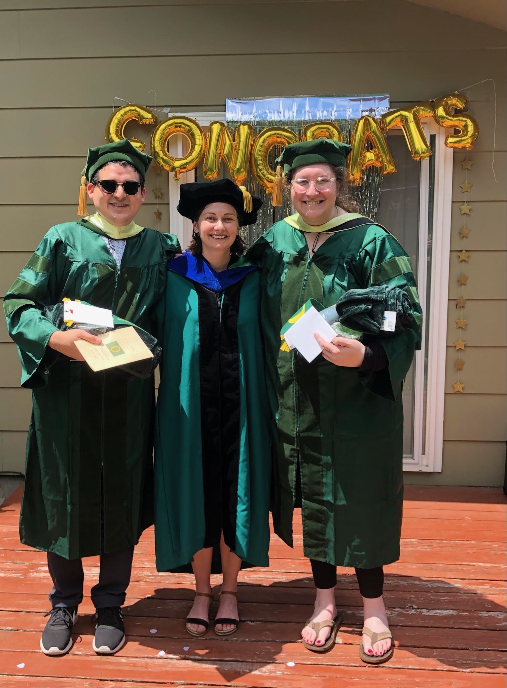
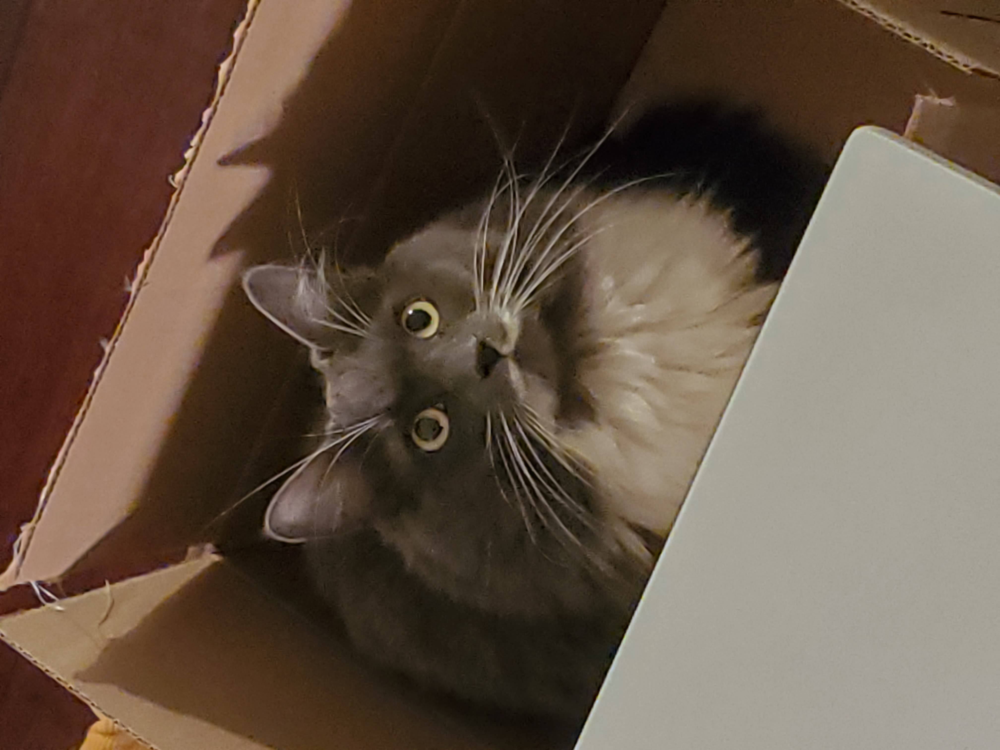
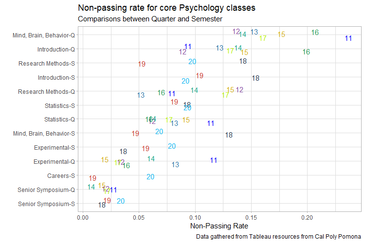

```{r setup, include=FALSE}
knitr::opts_chunk$set(echo = TRUE)

library(tidyverse)
library(xaringanthemer)
style_duo(primary_color = '#56B4E9', secondary_color = 'black')
```

# Agenda

- Introductions
- Syllabus
- Review
- Types of Research
- Steps of Conducting Statistics Within the Research Process
- Levels of Measurement
  - Measurement Error
- Measurement Scales

---

# About Me

- My name is Jonathan A. Pedroza (he/him)
  - please refer to me as **JP** unless around other instructors/faculty
  
- First-generation Graduate
  - CPP Alumni (2014)
  - CSUDH (2017)
  - University of Oregon (2021)
  
---

# About Me



---

# About Me


---

# About Me



---

# Nerdy Stuff

- Passion/Nerdy Topics:
  - I love creating data visualizations in `R`
  - health inequities in communities of color
  - examining environmental variables that influence health behaviors

---

# Nerdy Stuff



---

# Break-out Rooms - Tell Me About Yourself

- Name & pronouns

- What do you want to do after you graduate?

- What is your experience with statistics?

- What is your experience with SPSS?

- Something that you are passionate/nerdy about

---

# Learning Objectives

- Use SPSS to compute statistics

- Read/Interpret Descriptive & Inferential Statistics

- Understand & Solve Formulas for Statistical Tests

- Understand Sampling, Statistical Null Hypothesis Testing, Effect Sizes, Confidence Intervals

- Demonstrate ability to apply these skills to test hypotheses using real data

---

# Topics Covered

- Descriptive Statistics
- Probability
- Random Selection
- Normal Curve & Sampling Distribution
- Hypothesis Testing
- Rules for Statistical Decisions (Types I and II Errors)
- Sample Size Importance (One- vs Two-tailed Tests)
- Z-scores, z-ratio, and t-ratio (single group, independent-samples t-test, paired)
- Analysis of Variance (One-way, Two-way, Repeated-measure, mixed)
- Confidence Intervals/Error bars in plots
- Most common plots (histograms, boxplots, scatterplots)
- Correlation & Regression Analysis
- Chi-square (One-way, Two-way)
- Non-parametric statistics

---

# You Might be Feeling Like...


---

# What I Need From You

- Cameras are optional
  - It helps me see if you are confused
  
- Unmute yourself and interrupt me

- put in the chat that you are confused

- private message me in the chat that you are confused
